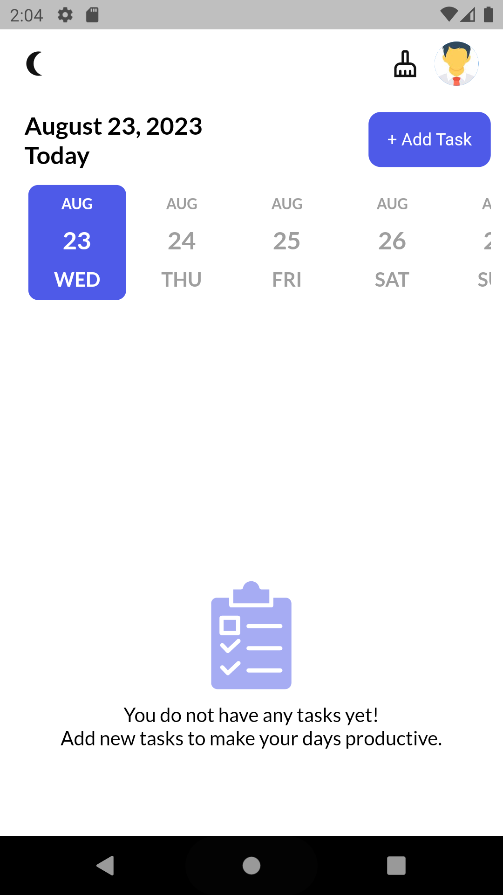
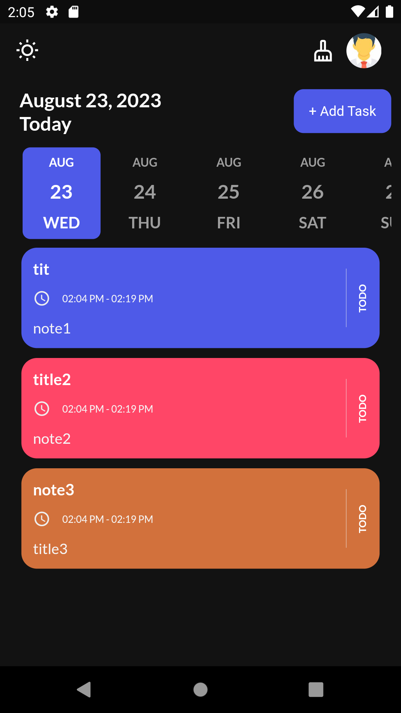
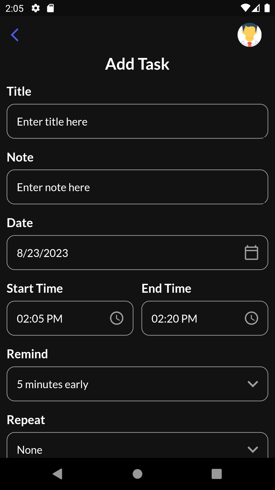

# TODO App with Flutter

A simple TODO app built using Flutter that helps you manage your tasks efficiently.

## Features

- Add tasks with due dates.
- Mark tasks as completed.
- Delete tasks you no longer need.
- Set task priorities.
- Receive local notifications for upcoming tasks.

## Screenshots





## Getting Started

Follow these instructions to get the project up and running on your local machine.

### Prerequisites

- Flutter SDK
- Android/iOS Emulator or Physical Device

### Installation

1. Clone the repository:

   ```bash
   git clone https://github.com/your-username/todo-app-flutter.git
   ```

2. Navigate to the project directory:

   ```bash
   cd todo-app-flutter
   ```

3. Install the dependencies:

   ```bash
   flutter pub get
   ```

4. Run the app:

   ```bash
   flutter run
   ```

## Dependencies

The app uses the following packages:

- `cupertino_icons: ^1.0.2`
- `get_storage: ^2.0.3`
- `get: ^4.3.8`
- `flutter_local_notifications: ^15.1.0+1`
- `intl: ^0.18.1`
- `google_fonts: ^5.1.0`
- `date_picker_timeline: ^1.2.3`
- `sqflite: ^2.0.0+4`
- `flutter_staggered_animations: ^1.0.0`
- `flutter_svg: ^2.0.7`
- `rxdart: ^0.27.2`
- `timezone: ^0.9.2`
- `flutter_timezone: ^1.0.7`

Make sure to add these dependencies to your `pubspec.yaml` file before running the app.
